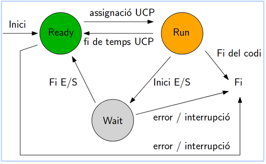

# Estats d'un process

<Strong>Ready:</Strong>
 El procés està carregat a la memòria i està a punt d'executar-se, però encara no s'ha assignat el temps de CPU. En un sistema amb múltiples processadors o nuclis, diversos processos poden estar en aquest estat esperant el seu torn d'execució.

<Strong>Run:</Strong>
 Aquest és l'estat en què el procés està realment executant-se a la CPU. Només pot haver-hi un procés en aquest estat per cada nucli de la CPU.

<Strong>Wait:</Strong>
També conegut com a estat de bloqueig, el procés es troba en aquest estat quan espera un esdeveniment extern per continuar l'execució. Això pot ser l'arribada d'una entrada/sortida, una resposta de la xarxa, etc.

## Transició d'estats

<Strong>Tornar a sistemes</Strong>-->https://github.com/itrigog-esliceu/Repository-1/tree/main/sistemes

<Strong>Fitxer principal</Strong>-->https://github.com/itrigog-esliceu/Repository-1/blob/main/README.md